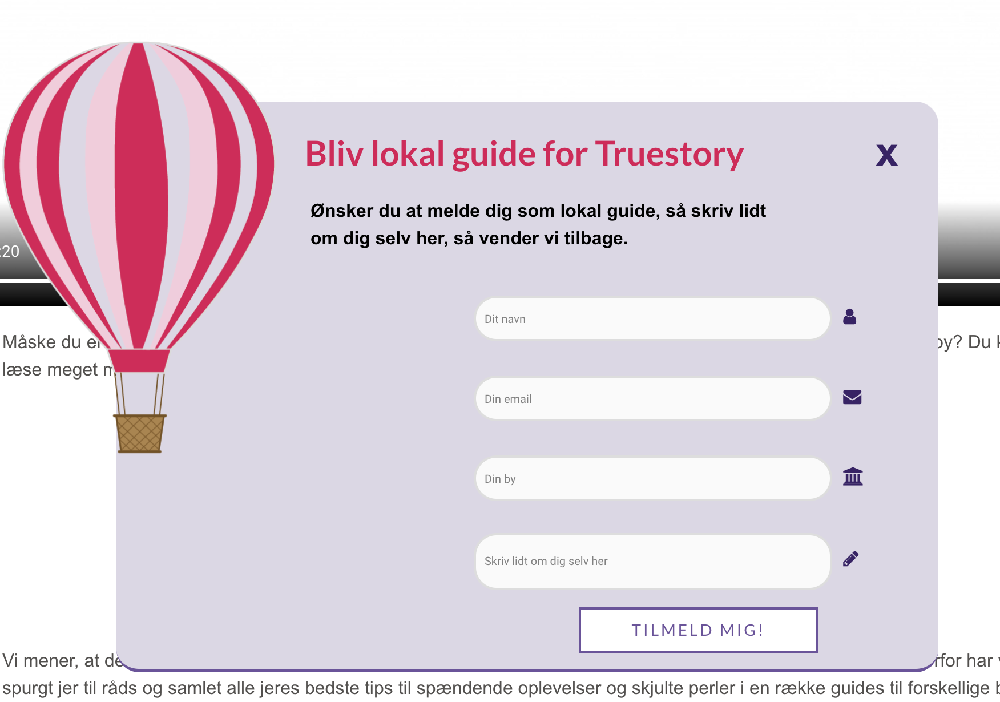

# Dette er GitHub til vores eksamen på 3sem. om storyscaping. 
Til vores storyscaping eksamen på 3. semester har vi skabt et website for virksomheden Truestory. 
Vi har implementeret et plug-in som er en tilmeldningsformular hvor man kan melde sig som lokal guide. 
I vores plug-in har vi tre felter (forms) som skal udfyldes samt en knap (button) som man klikker på for at indsende sine oplysninger.
Vi har desuden tegnet en luftballon som vises når plug-innet kommer frem. Vores plug-in vises ved en on-click function som gør at plug-innet vises (og lukkes) når brugeren trykker på knappen. 

# WordPress-tilmeld-plugin

***

## Download the repository from GitHub.com 
Download det repository, som hedder **wordpress-newsletterplugin-main** til din computer.

## Unzip dette repository
Efter at have downloadet dette repository **wordpress-newsletterplugin-main** til din computer, skal du unzippe zip filen og du vil få en mappe, der hedder **wordpress-newsletterpluginn-main**

## Omdøb mappe
Derefter skal du omdøbe mappen til **tilmeld-plugin**
Husk du også skal ændre titlen alle andre steder, hvor der står ''newsletterplugin''. 

## Kopier mappen ind i din WordPress wp-content/plugins mappe
Kopier din **tilmeld-plugin** mappe og indsæt den i dit wordpress root-directory --> wp-content --> **plugins**

## Gå til dit WordPress Dashboard og aktiver dit plugin
Log ind på dit WordPress Dashboard og tryk på plugin i menuen. Her skal du aktivere dit nye plugin. - **tilmeld-plugin Plugin**.

## Indsæt dit plugin
Gå til din WordPress side og vælg, hvor dit plugin skal indsættes. Tilføj denne shortcode på det valgte sted - **[show_newsletter]**

## Besøg siden
Du kan nu se din plugin på din side. 
