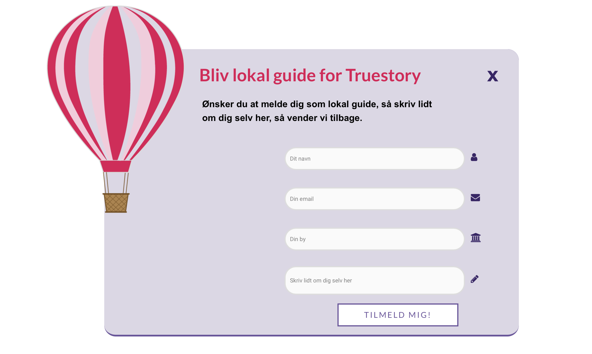

# Dette er GitHub til vores eksamen på 3sem. om storyscaping. 
Til vores storyscaping eksamen på 3. semester har vi skabt et website for virksomheden Truestory. 
Vi har implementeret et plug-in som er en tilmeldningsformular hvor man kan melde sig som lokal guide. 
I vores plug-in har vi tre felter (forms) som skal udfyldes samt en knap (button) som man klikker på for at indsende sine oplysninger.
Vi har desuden tegnet en luftballon som vises når plug-innet kommer frem. Vores plug-in vises ved en on-click function som gør at plug-innet vises (og lukkes) når brugeren trykker på knappen. 

# WordPress-tilmeld-plugin

***

## Vi downloadede et repository fra GitHub.com 
Vi har downloadet det repository, som hedder **wordpress-newsletterplugin-main** til vores computer.

## Vi unzippede dette repository
Efter at have downloadet dette repository **wordpress-newsletterplugin-main** til vores computer, unzippede vi zip filen og havde dermed en mappe, der hed **wordpress-newsletterplugin-main**

## Vi omdøbte mappen
Derefter omdøbte vi mappen til **tilmeld-plugin**

## Vi kopierede mappen ind i vores WordPress wp-content/plugins mappe
Vi kopiererde derefter **tilmeld-plugin** mappe og indsatte den i vores wordpress root-directory --> wp-content --> **plugins**

## Vi gik ind på vores WordPress Dashboard og aktiverede vores plugin
Vi loggede ind på vorers WordPress Dashboard og trykkede på plugin i menuen. Her aktiverede vi vores nye plugin. - **tilmeld-plugin Plugin**.

## Vi indsatte vores plugin
Vi gik derefter til vores WordPress side og valgte, hvor dette plugin skulle indsættes. Vi tilføjede denne shortcode på det valgte sted - **[show_newsletter]** (dette er stadig newsletter, da vi ikke har ændret det i vores PHP fil). 

## Vi besøgte siden
Vi kunne derefter se vores plugin, hvor vi havde indsat vores shortcode. 
